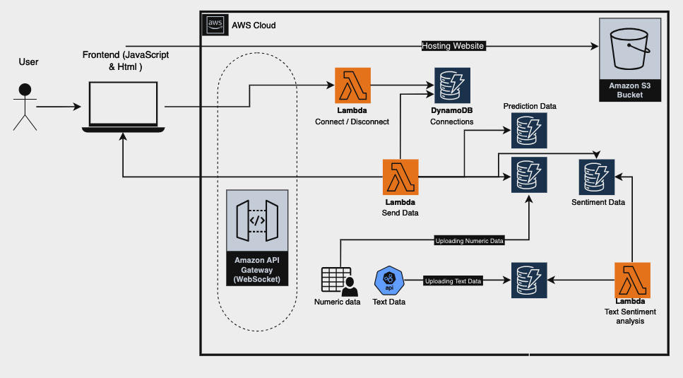
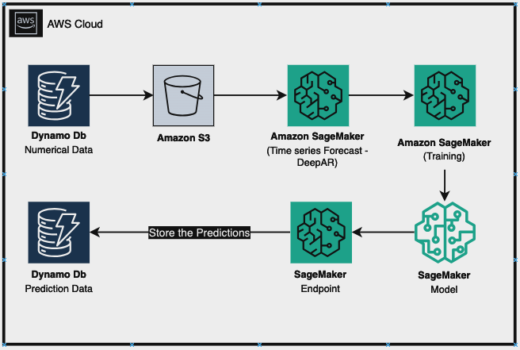
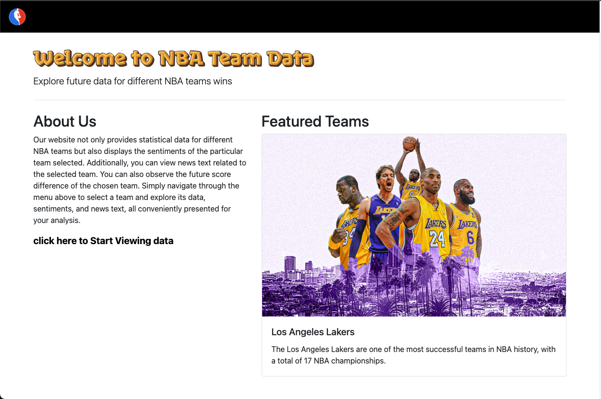
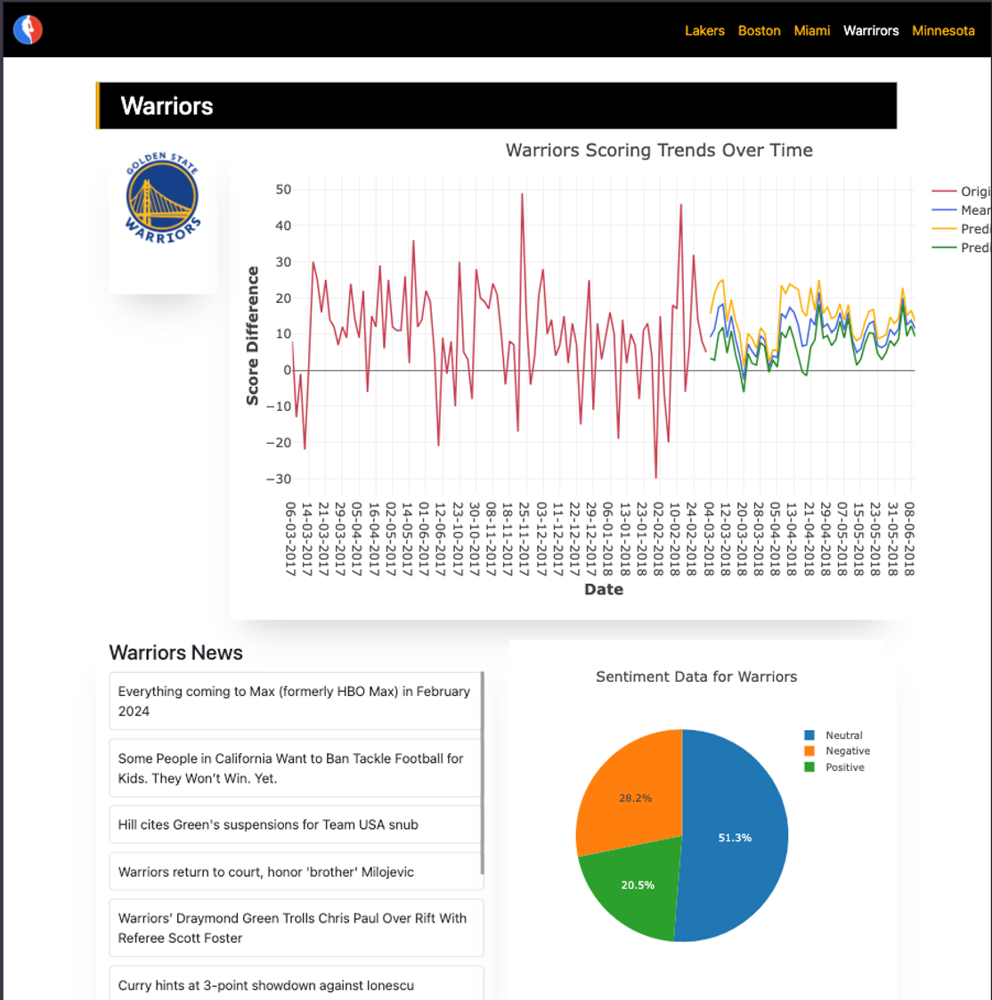

# NBA Visualization

This project aims to predict the future scores of NBA teams based on their previous score differences and visualize the data. The focus teams for this project are the Golden State Warriors, Los Angeles Lakers, Timberwolves, Boston Celtics, and Miami Heat.

<h1>Technology Used</h1>

- AWS (Amazon Web Services)
- DynamoDB
- Lambda
- API Gateway
- Amazon S3
- Amazon SageMaker

<h1>Data Collection</h1>

Data for the project was collected from an NBA dataset on Kaggle, focusing on the score differences of the chosen NBA teams. The data was stored in DynamoDB on AWS. Additionally, text data for sentiment analysis was collected from news headlines of the teams via news API, and the timestamped data was stored in DynamoDB.

<h1>Sentiment Analysis</h1>

A Lambda function was implemented for sentiment analysis calculation. A trigger was connected to the DynamoDB table containing the text data to automatically execute the sentiment analysis calculator whenever new data was uploaded. The results were stored in a new DynamoDB database with the sentiment scores of each headline article retrieved.

<h1>WebSocket Implementation</h1>

A Lambda function was configured to respond to WebSocket events for sending the data to users, facilitated by AWS API Gateway. This ensured effective delivery of sentiment analysis data, numerical data, and prediction data to users upon connection. Triggers were implemented to send updated data whenever the numerical data, sentiment data, or prediction table was updated.

<h1>Data Prediction</h1>

Prediction data was obtained by utilizing timestamps of numerical data and score differences. Two files were created, one containing all collected data and another containing 100 points for model training. The collected data was stored in Amazon S3. A training job was created in Amazon SageMaker, followed by the creation of a model, Endpoint Configuration, and Endpoint for each team's data. Using the endpoint of each team and the 100 points removed from the training data, predictions were made and stored in DynamoDB as predicted data.

<h1>Architecture</h1>

<h1>Website Screenshots</h1>

